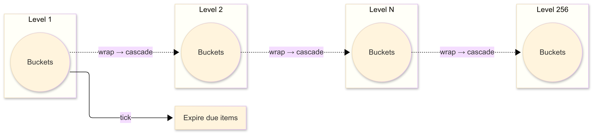

## taskwheel

[](https://pkg.go.dev/github.com/ankur-anand/taskwheel)
[](https://goreportcard.com/report/github.com/ankur-anand/taskwheel)

A high-performance, generic **Hierarchical Timing Wheel** implementation in Go for efficient timer management at scale.



## Why TaskWheel?

When you need to manage thousands or millions or timers (timeouts, TTLs, scheduled tasks) etc. While Go's standard `time.Timer` is excellent, it faces some challenges at high volumes.

## Use Case: Expiring 10 Million Cache Keys Efficiently

Traditional cache cleanup scans every key (`O(n)`), which works fine at small scale — but completely breaks down once you hit **millions** of entries.

Using a **Timing Wheel**, expiration becomes `O(1)` per tick — processing *only* the keys that are actually due right now.

### Read Stall Comparison (10 Million Keys)

|**Metric**|**Naive Scan**|**Timing Wheel**|
|:-|:-|:-|
|**Avg Read Latency**|4.68 ms|**3.15 µs**|
|**Max Read Stall**|500 ms|**≈ 2 ms**|

At **10 million keys**, a naive cleanup can stall reads for seconds — while the **Timing Wheel** glides through them *in microseconds*.

**Read the full story on Medium:**  
[Killing O(n): How Timing Wheels Expire 10 Million Keys Effortlessly in Golang](https://medium.com/@ankur_anand/killing-o-n-how-timing-wheels-expire-10-million-keys-effortlessly-in-golang-9a6b8709fd91)

### Installation

```bash
go get github.com/ankur-anand/taskwheel
```

### Quick Start

```go
package main

import (
	"fmt"
	"time"

	"github.com/ankur-anand/taskwheel"
)

func main() {
	// Create hierarchical timing wheel
	intervals := []time.Duration{10 * time.Millisecond, 1 * time.Second}
	slots := []int{100, 60}
	wheel := taskwheel.NewHierarchicalTimingWheel[string](intervals, slots)

	// Start the wheel
	stop := wheel.Start(10*time.Millisecond, func(timer *taskwheel.Timer[string]) {
		fmt.Printf("Timer fired: %s\n", timer.Value)
	})
	defer stop()

	// Schedule timers
	wheel.AfterTimeout("task1", "Process payment", 100*time.Millisecond)
	wheel.AfterTimeout("task2", "Send email", 500*time.Millisecond)

	time.Sleep(1 * time.Second)
}
```

### High-Throughput Usage (10,000+ timers/sec)

For production systems with high timer volumes, use `StartBatch()` with a worker pool:

```go
package main

import (
	"fmt"
	"runtime"
	"sync"
	"time"

	"github.com/ankur-anand/taskwheel"
)

func main() {
	intervals := []time.Duration{10 * time.Millisecond, 100 * time.Millisecond, time.Second}
	slots := []int{10, 100, 60}
	wheel := taskwheel.NewHierarchicalTimingWheel[string](intervals, slots)

	// Create worker pool
	workerPool := make(chan *taskwheel.Timer[string], 1000)
	var wg sync.WaitGroup

	numWorkers := runtime.NumCPU() * 2
	for i := 0; i < numWorkers; i++ {
		wg.Add(1)
		go func() {
			defer wg.Done()
			for timer := range workerPool {
				// process timer
				processTask(timer)
			}
		}()
	}

	// start with batch callback
	stop := wheel.StartBatch(10*time.Millisecond, func(timers []*taskwheel.Timer[string]) {
		for _, t := range timers {
			workerPool <- t
		}
	})

	// schedule timers
	for i := 0; i < 10000; i++ {
		wheel.AfterTimeout(
			taskwheel.TimerID(fmt.Sprintf("task-%d", i)),
			fmt.Sprintf("Task %d", i),
			time.Duration(i)*time.Millisecond,
		)
	}

	time.Sleep(15 * time.Second)
	stop()
	close(workerPool)
	wg.Wait()
}

func processTask(timer *taskwheel.Timer[string]) {
	// business logic here
}
```

### Performance Comparison

```bash
goos: darwin
goarch: arm64
pkg: github.com/ankur-anand/taskwheel
cpu: Apple M2 Pro
BenchmarkNativeTimers/1K_timers_100ms-10                             	      10	 102317362 ns/op	  136000 B/op	    2000 allocs/op
BenchmarkNativeTimers/10K_timers_100ms-10                            	      10	 113182400 ns/op	 1360000 B/op	   20000 allocs/op
BenchmarkNativeTimers/100K_timers_1s-10                              	       1	1093996708 ns/op	13600000 B/op	  200000 allocs/op
BenchmarkTimingWheelAfterTimeout/1K_timers_100ms-10                  	      10	 110006242 ns/op	  214488 B/op	    1056 allocs/op
BenchmarkTimingWheelAfterTimeout/10K_timers_100ms-10                 	      10	 110001250 ns/op	 1973784 B/op	   10181 allocs/op
BenchmarkTimingWheelAfterTimeout/100K_timers_100ms-10                	       9	 121230764 ns/op	18755629 B/op	  101093 allocs/op
BenchmarkMemoryComparison/Native_10K_timers-10                       	      10	 111245146 ns/op	 1336540 B/op	   20001 allocs/op
BenchmarkMemoryComparison/TimingWheel_10K_timers-10                  	      10	 109956992 ns/op	 1973784 B/op	   10181 allocs/op
BenchmarkTimingWheel_Memory/Timers_100000-10                         	      67	  19544636 ns/op	 9665561 B/op	  600001 allocs/op
BenchmarkTimingWheel_Memory/Timers_1000000-10                        	       6	 199790202 ns/op	96065897 B/op	 6000003 allocs/op
BenchmarkTimingWheel_Memory/Timers_10000000-10                       	       1	1807187459 ns/op	960067416 B/op	60000009 allocs/op
BenchmarkNativeTimer_Memory/Timers_100000-10                         	     140	  12572099 ns/op	15329470 B/op	  100001 allocs/op
BenchmarkNativeTimer_Memory/Timers_1000000-10                        	      13	 145825920 ns/op	151103566 B/op	 1000001 allocs/op
BenchmarkNativeTimer_Memory/Timers_10000000-10                       	       1	1309542667 ns/op	1705383936 B/op	10000002 allocs/op
```
### Performance Comparison

| Workload              | Metric     | NativeTimers | TimingWheel | Difference |
|-----------------------|------------|--------------|-------------|------------|
| **1K timers (100ms)** | Time/op    | 102 ms       | 110 ms      | +8% slower |
|                       | Mem/op     | 136 KB       | 214 KB      | +58% more  |
|                       | Allocs/op  | 2.0 K        | 1.1 K       | -47% fewer |
| **10K timers (100ms)**| Time/op    | 113 ms       | 110 ms      | -3% faster |
|                       | Mem/op     | 1.36 MB      | 1.97 MB     | +45% more  |
|                       | Allocs/op  | 20.0 K       | 10.2 K      | -49% fewer |
| **100K timers (1s)**  | Time/op    | 1.09 s       | 0.12 s      | -89% faster |
|                       | Mem/op     | 13.6 MB      | 18.8 MB     | +38% more  |
|                       | Allocs/op  | 200.0 K      | 101.1 K     | -50% fewer |

**At very small scales (≈1K timers)**, TimingWheel shows a slight overhead (+8% slower, more memory).  
But once you reach **10K+ timers**, it matches or beats native performance, consistently cuts allocations ~50%,
and at **100K timers** it’s ~9× faster with half the allocations.

## Advanced Usage

### Custom Payload Types

```go
type Task struct {
    UserID   string
    Action   string
    Priority int
}

wheel := taskwheel.NewHierarchicalTimingWheel[Task](intervals, slots)
wheel.AfterTimeout("task1", Task{
    UserID:   "user123",
    Action:   "send_email",
    Priority: 1,
}, 5*time.Second)
```

### Priority-Based Processing

```go
stop := wheel.StartBatch(10*time.Millisecond, func(timers []*taskwheel.Timer[Task]) {
    // Sort by priority
    sort.Slice(timers, func(i, j int) bool {
        return timers[i].Value.Priority > timers[j].Value.Priority
    })
    
    for _, t := range timers {
        processTask(t)
    }
})
```

## License

MIT License - see [LICENSE](LICENSE) file for details

## Credits

Inspired by:
- [Kafka's Hierarchical Timing Wheels](https://www.confluent.io/blog/apache-kafka-purgatory-hierarchical-timing-wheels/)
- ["Hashed and Hierarchical Timing Wheels" paper](http://www.cs.columbia.edu/~nahum/w6998/papers/ton97-timing-wheels.pdf)

